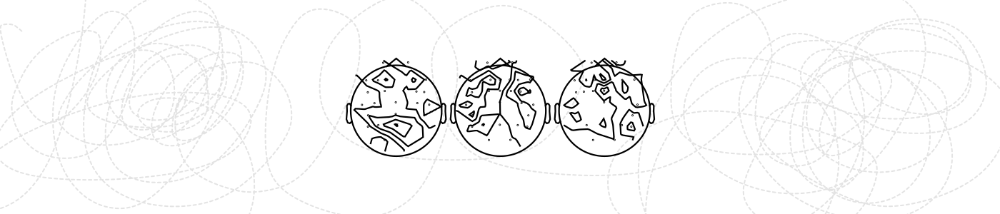

  

<h1 align="center">Nikolay Syrov</h1>

  
  
  
  

---

### Research

Neuroscience · EEG · TMS-EEG · fNIRS · signal processing · brain–computer interfaces ·

### Tools

  
  
  
  
  
  
  
  

---